# Modèle d'Estimation des Offres Financières pour les Appels d'Offres

##  Description du Projet

Ce projet vise à développer un modèle prédictif intelligent pour estimer le montant optimal d'une offre financière dans un appel d'offres (AO), basé sur l'analyse des données historiques des marchés publics. Le système aide les entreprises à proposer des montants compétitifs en maximisant leurs chances de remporter les appels d'offres.

##  Objectifs

- **Estimation intelligente** : Proposer une fourchette de prix optimale (X DH à Y DH) pour maximiser les chances de gagner un AO
- **Analyse concurrentielle** : Analyser les comportements passés des concurrents sur des AO similaires
- **Simulation de probabilités** : Calculer la probabilité de succès selon différents montants proposés
- **Recommandations automatisées** : Fournir des conseils du type "Pour maximiser vos chances (>60%), proposez entre X et Y DH"

##  Architecture du Système

```mermaid
graph TB
    A[Données Historiques AO] --> B[Collecte et Nettoyage]
    B --> C[Feature Engineering]
    C --> D[Modèle ML]
    D --> E[API REST]
    D --> F[Interface Utilisateur]
    E --> G[Prédictions]
    F --> G
    
    subgraph "Sources de Données"
        H[Marches Publics]
        I[Safakate]
    end
    
    H --> A
    I --> A
    
    subgraph "Technologies"
        J[Scikit-learn]
        K[XGBoost/LightGBM]
        L[MLflow]
        M[FastAPI/Flask]
        N[Streamlit/React]
    end
    
    J --> D
    K --> D
    L --> D
    M --> E
    N --> F
```



##  Flux de Traitement des Données

```mermaid
flowchart LR
    A[Nouvel AO] --> B[Extraction Features]
    B --> C[Liste Concurrents]
    C --> D[Modèle Prédictif]
    D --> E[Probabilité Succès]
    D --> F[Fourchette Prix Recommandée]
    E --> G[Recommandation Finale]
    F --> G
    
    subgraph "Features Calculées"
        H[Budget AO]
        I[Type AO]
        J[Taux Succès Concurrents]
        K[Historique Prix]
    end
    
    B --> H
    B --> I
    C --> J
    C --> K
```



##  Pipeline de Machine Learning


##  Structure du Projet

```
├── data/
│   ├── raw/                 # Données brutes collectées
│   ├── processed/           # Données nettoyées (CSV)
│   └── features/            # Features engineered
├── models/
│   ├── model.pkl           # Modèle entraîné
│   ├── preprocessing.pkl   # Pipeline de préprocessing
│   └── experiments/        # Expériences MLflow
├── src/
│   ├── data_collection/    # Scripts de collecte
│   ├── preprocessing/      # Nettoyage des données
│   ├── feature_engineering/ # Création des features
│   ├── modeling/           # Entraînement du modèle
│   └── api/               # API REST
├── app/
│   ├── streamlit_app.py   # Interface Streamlit
│   └── react_app/         # Interface React (optionnel)
├── tests/                 # Tests unitaires
├── docs/                  # Documentation
├── requirements.txt       # Dépendances Python
└── README.md             # Ce fichier
```

##  Technologies Utilisées

### Collecte de Données
- **Sources** : Marches Publics, Safakate
- **Format** : CSV structuré

### Machine Learning
- **Scikit-learn** : Classification et régression
- **XGBoost/LightGBM** : Modèles performants pour données tabulaires
- **MLflow** : Suivi des expériences et versioning des modèles

### API et Interface
- **FastAPI/Flask** : API REST
- **Streamlit/React** : Interface utilisateur
- **SHAP** : Explicabilité du modèle (optionnel)

##  Installation

1. **Cloner le repository**
```bash
git clone https://github.com/Abdelilah04116/Estimation_Offres_Financi-res
cd Estimation_Offres_Financi-res
```

2. **Créer un environnement virtuel**
```bash
python -m venv venv
source venv/bin/activate  # Sur Windows: venv\Scripts\activate
```

3. **Installer les dépendances**
```bash
pip install -r requirements.txt
```

4. **Configuration de l'environnement**
```bash
cp .env.example .env
# Modifier les variables d'environnement selon vos besoins
```

##  Utilisation

### 1. Collecte des Données
```bash
python src/data_collection/scraper.py
```

### 2. Préprocessing
```bash
python src/preprocessing/clean_data.py
```

### 3. Entraînement du Modèle
```bash
python src/modeling/train_model.py
```

### 4. Lancement de l'API
```bash
uvicorn src.api.main:app --reload
```

### 5. Interface Utilisateur
```bash
streamlit run app/streamlit_app.py
```

##  API Endpoints

### Prédiction d'Offre
```http
POST /predict
Content-Type: application/json

{
  "ao_data": {
    "budget": 50000,
    "type": "travaux",
    "maitre_ouvrage": "Ministère",
    "delai_execution": 6
  },
  "concurrents": [
    {"nom": "Entreprise A", "historique_prix": [25000, 30000, 28000]},
    {"nom": "Entreprise B", "historique_prix": [26000, 29000, 27500]}
  ],
  "montant_propose": 27000
}
```

**Réponse :**
```json
{
  "probabilite_succes": 0.67,
  "fourchette_recommandee": {
    "min": 27500,
    "max": 28500
  },
  "conseil": "Proposez entre 27500 et 28500 DH pour rester compétitif contre vos concurrents",
  "facteurs_influents": {
    "budget_ratio": 0.55,
    "competition_niveau": "moyen",
    "historique_concurrent": "favorable"
  }
}
```

##  Exemple d'Usage

```python
from src.api.predictor import AOPredictor

# Initialiser le prédicteur
predictor = AOPredictor()

# Charger un nouvel AO
ao_data = {
    "reference": "AO-2025-001",
    "budget": 50000,
    "type": "consultation",
    "maitre_ouvrage": {"nom": "Commune de Rabat"}
}

# Liste des concurrents
concurrents = [
    {"nom": "Cabinet A",....},
    {"nom": "Cabinet B",....}
]

# Obtenir la prédiction
result = predictor.predict(ao_data, concurrents, montant_propose=28000)

print(f"Probabilité de succès : {result['probabilite_succes']}")
print(f"Recommandation : {result['conseil']}")
```

##  Métriques et Performance

Le modèle est évalué sur les métriques suivantes :
- **Accuracy** : Précision de prédiction binaire (gagné/perdu)
- **ROC-AUC** : Aire sous la courbe ROC
- **Precision/Recall** : Pour les classes déséquilibrées
- **Mean Absolute Error** : Pour l'estimation des montants

##  Features Importantes

Le modèle utilise les features suivantes :
- **Budget de l'AO** : Montant total disponible
- **Type d'AO** : Travaux, consultation, fournitures
- **Ratio prix/budget** : Montant proposé / Budget total
- **Nombre de concurrents** : Niveau de compétition
- **Historique des concurrents** : Taux de succès, prix moyens
- **Caractéristiques temporelles** : Délai d'exécution, période de l'année

##  Roadmap

- [x] Collecte et nettoyage des données
- [x] Feature engineering et analyse exploratoire
- [x] Développement du modèle de base
- [ ] Optimisation des hyperparamètres
- [ ] Intégration SHAP pour l'explicabilité
- [ ] Déploiement de l'API en production
- [ ] Interface utilisateur avancée
- [ ] Tests et validation sur nouveaux données


##  Auteur

**Abdelilah OURTI**
- Stage : Juillet - Septembre 2025
- Entreprise : TECFORGE

## 📞 Support

Pour toute question ou support, veuillez contacter :
- Email : abdelilahourti@gmail.com


---
